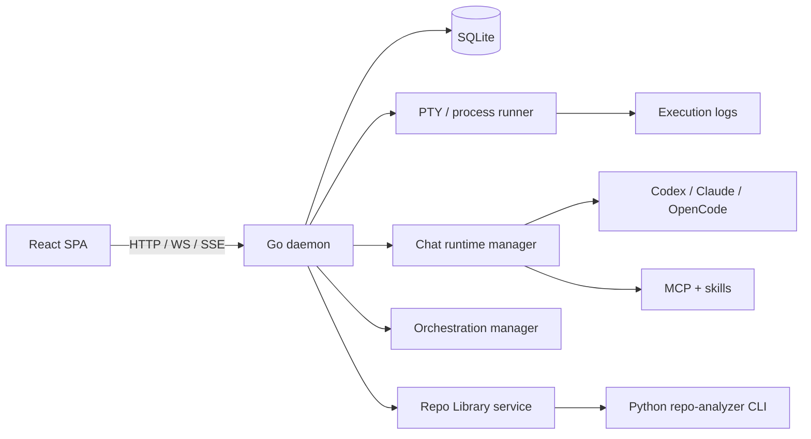

<div align="center">

<h1>VibeCraft</h1>

<p>
  <strong>一个本地优先的 AI 工程工作台，把对话、编排执行和 GitHub 知识库放进同一个工作面。</strong>
</p>

<p>
  <a href="#产品能力">产品能力</a> ·
  <a href="#repo-library-是怎么工作的">Repo Library</a> ·
  <a href="#快速开始">快速开始</a> ·
  <a href="#架构">架构</a> ·
  <a href="#项目结构">项目结构</a> ·
  <a href="#验证">验证</a> ·
  <a href="./docs/README.en.md">English</a>
</p>

<p>
  
  
  
  
  
  
  
</p>

</div>

`VibeCraft` 是一个本地优先的 AI 工程工作台，把对话、任务编排和 GitHub 仓库知识沉淀放进同一个桌面级工作面。后端由 Go daemon 统一管理会话、任务、运行时与恢复流程，前端用 React 呈现实时界面，数据落在本地 SQLite，CLI runtime 通过 PTY 接入，仓库分析结果则沉淀为可持续复用的本地知识库。

当前产品主线聚焦三部分：

- `Chat`：本地会话、CLI runtime、MCP、skills、附件、多模态输入
- `Orchestration`：多代理任务编排、执行、继续、取消、重试和产物追踪
- `Repo Library`：围绕 GitHub 仓库构建的知识库，包含正式报告、知识卡片、证据链和向量检索

`Legacy Workflow` 仍然保留，主要作为兼容入口。

## 产品能力

### 1. Orchestration 工作台

这一层已经不是单纯“点一下跑脚本”，而是完整的编排执行面。

- 可以在 UI 中创建 orchestration，并查看 round 级执行过程
- 可以追踪 agent run、事件流、日志、继续、重试、取消和落地产物
- coding 场景会为 agent 准备 workspace / worktree 上下文
- backend 有独立的 orchestration manager、execution store 和更新链路，daemon 重启后也能做状态恢复

如果你把它理解成“给本地 AI coding 工作流准备的控制台”，会比较贴切。

### 2. Chat 工作台

`Chat` 这一层是当前 README 里最容易被写浅的地方，实际能力比“有个聊天页”要多得多。

当前内建的 CLI runtime 至少包括：

- `Codex CLI`
- `Claude Code`
- `OpenCode CLI`

这里不是简单地切换一个模型名，而是切换一整套本地运行时配置。运行时里会带上对应的工具路径、协议族、MCP 注入、skill 注入、模型选择和会话级设置。`Codex CLI` 则支持导入历史对话线程，把本机已有的工作记录重新纳入应用内。

除此之外，这一层还包含：

- 会话级 MCP server 选择
- skills 注入
- 附件上传与预览
- 多模态输入
- 自动上下文压缩
- 本地持久化的 chat session / turn 时间线

所以更准确地说，这里做的是一个“本地 CLI agent 会话工作台”，不是普通聊天框。

### 3. Repo Library

`Repo Library` 主要不是“仓库收藏夹”，而是 `VibeCraft` 里的 GitHub 知识库。

它的目标是把一次 GitHub 仓库分析拆成几层后续可复用的资产：

- 正式报告：适合完整讲清某个项目或某项能力的实现方式
- 知识卡片：把关键机制拆成更小的复用单元
- 证据链：保留 `file:line` 级别的源码定位
- 搜索索引：让历史分析结果能被再次检索和召回

这层能力已经有完整的 UI 和 API，包括仓库列表、详情、分析记录、卡片、证据和模式搜索，不是停留在离线脚本阶段。

### 4. Legacy Workflow Runner

老的 workflow runner 还在。

- 原始 DAG workflow 路径仍可运行
- 节点通过 PTY 执行并实时输出日志
- workflow / node / execution 状态继续存 SQLite
- daemon 重启后会把遗留运行状态做恢复或回收

现在它更像兼容层，不再是项目的唯一中心。

## Repo Library 是怎么工作的

如果只看 UI，Repo Library 很容易被理解成“分析一个 GitHub 仓库，然后生成一篇 Markdown”。实际链路要完整得多。

大体流程是：

1. 用户提交 GitHub 仓库 URL、分支、特性问题、语言和 CLI tool / model 选择
2. backend 创建 analysis 记录，准备本地存储目录，并启动 AI Chat 分析链路
3. `services/repo-analyzer/app/cli.py` 负责 `prepare`、`pipeline`、`ingest`、`extract-cards`、`validate-report`、`search` 这些子命令
4. 报告写回本地后，再继续抽取知识卡片、证据链并刷新搜索索引
5. UI 可以在仓库详情页里查看 report、cards、evidence，也可以在 Pattern Search 里检索历史实现模式

这意味着 Repo Library 不是一次性的“分析结果页面”，而是一套持续可复用的 GitHub 知识沉淀流程。

## 向量检索与模式搜索

这部分值得单独说，因为它决定了 Repo Library 是知识库还是档案柜。

- 分析产物会被整理进本地 search corpus
- 搜索索引由 Go 侧 `searchdb` 管理，并按 analysis / card / evidence 做归一化
- 默认支持本地 embedder 模式，缺失时会降级到 keyword-only 检索
- 搜索结果会尽量回到稳定对象上，而不是只给一段孤立文本

结果上看，它更接近“GitHub 实现知识库”，而不是“把报告都存下来”。

## 为什么做这个项目

很多 AI 工程工具各自只解决一块问题：

- 聊天在一个产品里
- 自动化在另一个产品里
- 本地执行靠命令行
- Repo 分析又是另一套流程

`VibeCraft` 的方向是把这些能力重新收拢到一个本地工作台里：

- daemon 负责统一的状态、执行和恢复
- UI 负责实时展示执行链路
- CLI runtime、MCP、skills 放在同一个产品面里配置
- GitHub 仓库分析结果沉淀成后续可召回的知识库

这也是它从 `vibe-tree` 这类早期实验形态，逐渐收敛到 `VibeCraft` 这个名字的原因之一。现在这个项目更像一个把 AI 工程实践“做成工作台”的产品，而不是一组零散脚本。

## 快速开始

### 环境要求

- Go
- Node.js
- pnpm
- Python 3，用于 `services/repo-analyzer/`

### 方式 A：开发模式

同时启动 backend 和 Vite dev server：

```bash
./scripts/dev.sh
```

说明：

- 脚本会先启动 backend，再启动 UI dev server
- backend 默认优先尝试 `air` 热重载
- 如果本机没有 `air` 但有 Go，脚本会自动执行 `go install github.com/air-verse/air@latest`
- UI 依赖安装与 dev server 都统一走 `pnpm`

如需强制使用普通 `go run`：

```bash
VIBECRAFT_NO_AIR=1 ./scripts/dev.sh
```

默认 daemon 地址：

```text
http://127.0.0.1:7777
```

### 方式 B：Web 单进程模式

先构建 UI，再由 daemon 直接托管 `ui/dist`：

```bash
./scripts/web.sh
```

打开：

```text
http://127.0.0.1:7777/
```

如果你已经提前构建过前端，也可以跳过 UI build：

```bash
VIBECRAFT_SKIP_UI_BUILD=1 ./scripts/web.sh
```

### 单独操作前端

```bash
pnpm -C ui install
pnpm -C ui dev
pnpm -C ui build
```

## 架构



### 核心运行层

| 层 | 职责 |
| --- | --- |
| `backend/` | Go daemon、HTTP API、WebSocket/SSE、chat runtime、orchestration、Repo Library、持久化 |
| `ui/` | React SPA，承载 chat、orchestrations、repo library、legacy workflows、settings |
| `services/repo-analyzer/` | Python CLI，负责仓库准备、报告生成、报告校验、卡片抽取和搜索索引 |
| `desktop/` | Wails 壳，负责本地桌面包装与 daemon 复用 |
| `scripts/` | 开发启动脚本和各类 agent runtime 辅助脚本 |

## 当前产品面

| 区域 | 当前状态 |
| --- | --- |
| Orchestrations | 已有列表页和详情页，支持 agent runs、日志、continue / retry / cancel |
| Chat Sessions | 已接入 CLI tool、MCP、skills、附件与本地会话持久化 |
| Repo Library | 已支持仓库列表、详情、analyses、report、cards、evidence、pattern search |
| Legacy Workflows | 仍保留页面和执行路径，作为兼容入口 |
| Desktop Shell | 已具备基础形态，但当前主开发回路仍以 Web 为主 |

## 开发工作流

### 前端

```bash
pnpm -C ui install
pnpm -C ui build
```

### 后端

```bash
cd backend && go test ./...
```

### Repo Analyzer 示例

```bash
python3 services/repo-analyzer/app/cli.py pipeline \
  --repo-url https://github.com/octocat/Hello-World \
  --ref main \
  --feature "routing" \
  --storage-root /tmp/repo-library \
  --run-id demo-run \
  --snapshot-dir /tmp/repo-library/snapshots/demo-run \
  --output /tmp/repo-library/pipeline.json
```

## 本地路径

- 配置文件：`~/.config/vibecraft/config.json`
- 数据目录：`~/.local/share/vibecraft/`
- SQLite：`~/.local/share/vibecraft/state.db`
- 执行日志：`~/.local/share/vibecraft/logs/<execution_id>.log`

兼容旧版本时，程序也会尝试读取旧的 `vibe-tree` 路径并做迁移兜底。

## 常用环境变量

### Backend

- `VIBECRAFT_HOST` / `VIBECRAFT_PORT`：覆盖监听地址
- `VIBECRAFT_MAX_CONCURRENCY`：调度并发上限
- `VIBECRAFT_KILL_GRACE_MS`：PTY 取消时从 `SIGTERM` 到 `SIGKILL` 的宽限时间
- `VIBECRAFT_ENV=dev|development`：启用 dev CORS 行为
- `VIBECRAFT_UI_DIST`：覆盖静态 UI dist 路径

### Repo Library / Search

- `VIBECRAFT_SQLITE_VEC_PATH`：指定 `sqlite-vec` 扩展路径
- `VIBECRAFT_EMBEDDER`：切换向量 embedder 模式，默认本地模式，可降级为 keyword-only

### dotenv

- 默认会自动加载仓库根目录的 `.env`
- `.env` 会覆盖进程里已有的同名环境变量
- 禁用自动加载：`VIBECRAFT_DOTENV=0`
- 指定自定义文件：`VIBECRAFT_DOTENV_PATH=/path/to/.env`

### Frontend

- `VITE_DAEMON_URL`：构建期覆盖 daemon URL

## 项目结构

| 路径 | 作用 |
| --- | --- |
| `backend/` | daemon、API、执行链路、orchestration、chat、Repo Library、持久化 |
| `ui/` | 应用壳、页面、状态存储、daemon client、实时 UI |
| `services/repo-analyzer/` | repo 分析 CLI、报告校验、卡片抽取、搜索流水线 |
| `desktop/` | Wails 桌面包装层 |
| `scripts/` | 本地启动脚本与 agent runtime 辅助脚本 |
| `openspec/` | 当前基线 specs 与 change proposals |
| `.codex/skills/` | 仓库级 Codex 协作流程与技能 |

如果要做实现级定位，先读 [PROJECT_STRUCTURE.md](./PROJECT_STRUCTURE.md)。

## 验证

推荐验证顺序：

1. 运行 `pnpm -C ui build`
2. 运行 `./scripts/dev.sh`，确认 Vite 应用可连接 daemon
3. 运行 `./scripts/web.sh`，确认生产静态托管可用
4. 运行 `cd backend && go test ./...`

建议人工检查项：

- 顶栏的 daemon health 与 WebSocket 状态能正确更新
- orchestrations 页面能正常展示并流式更新进度
- chat sessions 页面能正常打开、切换 CLI tool 并保存本地会话状态
- repo library 页面能加载仓库、分析详情、卡片和搜索结果
- legacy workflow 页面仍可作为兼容路径使用
- 生产静态模式下开发专用入口保持隐藏

## Desktop

仓库里已经包含基于 Wails 的 `desktop/`。当前默认开发回路仍建议走 Web，但桌面壳已经能用于本地应用封装和 daemon 复用。

## 当前阶段

`VibeCraft` 还处在 MVP 向平台化过渡的阶段，不过主轴已经清楚很多：

- 原始 DAG workflow runner 继续保留，但主要承担兼容角色
- orchestration、chat runtime 集成和 repo library 已经成为主线
- Desktop 包装层存在，但目前主要开发回路仍以 Web 为主
