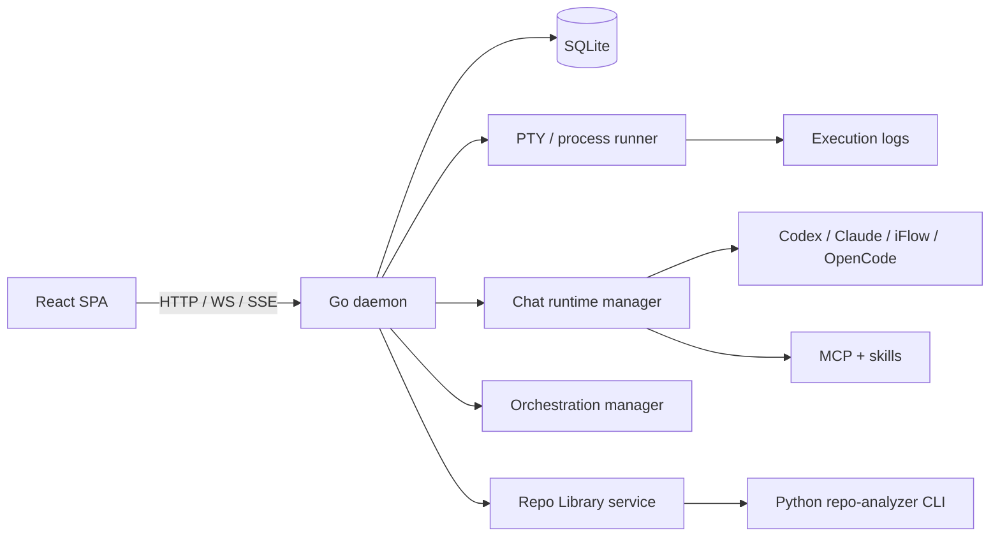

# VibeCraft

<div align="center">

<h1>VibeCraft</h1>

<p>
  <strong>Local-first AI engineering workspace for chat, orchestration, and GitHub knowledge workflows.</strong>
</p>

<p>
  <a href="../README.md">中文</a> ·
  <a href="#product-surface">Product Surface</a> ·
  <a href="#how-repo-library-works">Repo Library</a> ·
  <a href="#quickstart">Quickstart</a> ·
  <a href="#architecture">Architecture</a> ·
  <a href="#project-layout">Project Layout</a> ·
  <a href="#verification">Verification</a>
</p>

<p>
  
  
  
  
  
  
  
</p>

</div>

`VibeCraft` is no longer just the early DAG workflow runner this repository started as. It is now a local-first AI engineering workspace where a Go daemon owns execution and state, a React UI renders live interaction, SQLite stores local state, CLI runtimes are wired through PTY, and GitHub repository analyses become a reusable local knowledge base.

The product is currently centered around three main lanes:

- `Orchestration`: multi-agent planning, execution, continuation, retry, cancellation, and artifact tracking
- `Chat`: local chat sessions with CLI runtimes, MCP, skills, attachments, and timeline persistence
- `Repo Library`: a GitHub knowledge base with formal reports, cards, evidence, and vector-backed retrieval

The original workflow runner still exists as a compatibility lane.

## Product Surface

### 1. Orchestration Workspace

This is more than a button that runs a task.

- create orchestration jobs from the UI
- inspect round-level execution details
- follow agent runs, logs, continue / retry / cancel actions, and generated artifacts
- prepare workspace or worktree context for coding-oriented agents

In practice, this is the control plane for local AI coding workflows.

### 2. Chat Workspace

The chat layer is not just a generic conversation page. It already supports multiple built-in CLI runtimes:

- `Codex CLI`
- `Claude Code`
- `iFlow CLI`
- `OpenCode CLI`

Those runtimes are tied to tool-level configuration, protocol family, model selection, MCP injection, skill injection, and per-session settings. `iFlow CLI` also has an in-app browser auth flow. `Codex CLI` history can be imported so existing local threads can be pulled back into the app.

Other chat capabilities include:

- session-level MCP selection
- skills injection
- file attachments and preview
- multimodal input
- automatic context compression
- daemon-backed local session and turn persistence

This makes the chat layer closer to a local CLI-agent workspace than a hosted chat UI.

### 3. Repo Library

`Repo Library` is best understood as the GitHub knowledge base inside `VibeCraft`.

Each repository analysis can be turned into reusable assets:

- formal reports for full implementation write-ups
- knowledge cards for smaller reusable mechanisms
- evidence chains with `file:line` references
- searchable indexes for later recall

It already has dedicated UI and API coverage for repository list, details, analyses, report rendering, cards, evidence, and pattern search.

### 4. Legacy Workflow Runner

The old workflow system is still present:

- DAG workflow execution path is still available
- nodes run through PTY with streamed logs
- workflow, node, and execution state stay in SQLite
- daemon restart recovery still covers unfinished runs

It is now a compatibility surface rather than the core identity of the product.

## How Repo Library Works

Repo Library is not just “analyze a repository and save a Markdown file”.

The rough flow is:

1. user submits a GitHub repository URL, ref, features/questions, language, CLI tool, and model
2. backend creates the analysis record, prepares storage, and starts the AI chat analysis chain
3. `services/repo-analyzer/app/cli.py` exposes `prepare`, `pipeline`, `ingest`, `extract-cards`, `validate-report`, and `search`
4. once a report is written, the system extracts cards, evidence, and refreshes search indexes
5. UI surfaces the report, cards, evidence, and pattern retrieval back to the user

That makes Repo Library a reusable GitHub knowledge workflow, not a one-off artifact page.

## Vector Retrieval and Pattern Search

This is the part that makes Repo Library a knowledge base instead of an archive.

- analysis outputs are synced into a local search corpus
- indexing is managed in Go search storage and normalized across analyses, cards, and evidence
- local embedding is supported, with fallback to keyword-only retrieval when embedder setup is unavailable
- retrieval aims to resolve back to stable objects, not just loose text snippets

## Why This Exists

Many AI engineering tools split the workflow across products:

- one tool for chat
- another for automation
- command line for local execution
- a separate flow for repository analysis

`VibeCraft` pulls those parts back into one local workspace:

- the daemon owns execution, persistence, and recovery
- the UI renders live state over WebSocket and SSE
- CLI runtimes, MCP, and skills are configured from one product surface
- GitHub analyses become a reusable local knowledge base

That is also why the project identity has moved away from `vibe-tree` and toward `VibeCraft`: the product is increasingly about shaping AI engineering work into a usable workspace.

## Quickstart

### Requirements

- Go
- Node.js
- pnpm
- Python 3 for `services/repo-analyzer/`

### Option A: Development Mode

Start backend and the Vite dev server together:

```bash
./scripts/dev.sh
```

Notes:

- the script starts the backend first, then the UI dev server
- backend hot reload uses `air` when available
- if `air` is missing and Go is installed, the script auto-installs `github.com/air-verse/air@latest`
- UI dependency install and dev startup are both handled through `pnpm`

To force a plain `go run` backend:

```bash
VIBECRAFT_NO_AIR=1 ./scripts/dev.sh
```

Default daemon URL:

```text
http://127.0.0.1:7777
```

### Option B: Web Single-Process Mode

Build the UI and let the daemon serve `ui/dist` directly:

```bash
./scripts/web.sh
```

Open:

```text
http://127.0.0.1:7777/
```

If the frontend is already built:

```bash
VIBECRAFT_SKIP_UI_BUILD=1 ./scripts/web.sh
```

### Frontend Commands

```bash
pnpm -C ui install
pnpm -C ui dev
pnpm -C ui build
```

## Architecture



### Core Runtime Layers

| Layer | Responsibility |
| --- | --- |
| `backend/` | Go daemon, HTTP APIs, WebSocket/SSE, chat runtime, orchestration, Repo Library, persistence |
| `ui/` | React SPA for chat, orchestrations, repo library, legacy workflows, and settings |
| `services/repo-analyzer/` | Python CLI for repo preparation, report generation, validation, card extraction, and search indexing |
| `desktop/` | Wails shell for local desktop packaging and daemon reuse |
| `scripts/` | development startup scripts and agent runtime helpers |

## Current Product Surface

| Area | Current status |
| --- | --- |
| Orchestrations | list/detail pages, agent runs, logs, continue / retry / cancel |
| Chat Sessions | CLI tools, MCP, skills, attachments, and local persistence |
| Repo Library | repository list, detail pages, analyses, reports, cards, evidence, pattern search |
| Legacy Workflows | retained as compatibility pages and execution flow |
| Desktop Shell | available, but web mode is still the primary development loop |

## Developer Workflow

### Frontend

```bash
pnpm -C ui install
pnpm -C ui build
```

### Backend

```bash
cd backend && go test ./...
```

### Repo Analyzer Example

```bash
python3 services/repo-analyzer/app/cli.py pipeline \
  --repo-url https://github.com/octocat/Hello-World \
  --ref main \
  --feature "routing" \
  --storage-root /tmp/repo-library \
  --run-id demo-run \
  --snapshot-dir /tmp/repo-library/snapshots/demo-run \
  --output /tmp/repo-library/pipeline.json
```

## Local Paths

- Config: `~/.config/vibecraft/config.json`
- Data root: `~/.local/share/vibecraft/`
- SQLite DB: `~/.local/share/vibecraft/state.db`
- Execution logs: `~/.local/share/vibecraft/logs/<execution_id>.log`

For compatibility, the app can still read legacy `vibe-tree` paths during migration.

## Common Environment Variables

### Backend

- `VIBECRAFT_HOST` / `VIBECRAFT_PORT`: override bind host and port
- `VIBECRAFT_MAX_CONCURRENCY`: scheduler concurrency limit
- `VIBECRAFT_KILL_GRACE_MS`: PTY cancel grace period from `SIGTERM` to `SIGKILL`
- `VIBECRAFT_ENV=dev|development`: enable dev CORS behavior
- `VIBECRAFT_UI_DIST`: override static UI dist path

### Repo Library / Search

- `VIBECRAFT_SQLITE_VEC_PATH`: path to `sqlite-vec`
- `VIBECRAFT_EMBEDDER`: choose embedder mode; defaults to local embedding with keyword-only fallback

### dotenv

- root `.env` is auto-loaded by default
- `.env` overrides existing process environment values
- disable loading with `VIBECRAFT_DOTENV=0`
- use a custom file with `VIBECRAFT_DOTENV_PATH=/path/to/.env`

### Frontend

- `VITE_DAEMON_URL`: build-time daemon URL override

## Project Layout

| Path | Purpose |
| --- | --- |
| `backend/` | daemon, APIs, execution, orchestration, chat, Repo Library, persistence |
| `ui/` | application shell, pages, stores, daemon client, live UI |
| `services/repo-analyzer/` | repo analysis CLI, report validation, card extraction, search pipeline |
| `desktop/` | Wails desktop wrapper |
| `scripts/` | local startup scripts and agent runtime helpers |
| `openspec/` | baseline specs and change proposals |
| `.codex/skills/` | repository-level Codex workflows and skills |

For implementation-level navigation, read [PROJECT_STRUCTURE.md](../PROJECT_STRUCTURE.md) first.

## Verification

Recommended validation flow:

1. Run `pnpm -C ui build`
2. Run `./scripts/dev.sh` and verify the Vite app can reach the daemon
3. Run `./scripts/web.sh` and verify production static hosting works
4. Run `cd backend && go test ./...`

Suggested manual checks:

- daemon health and WebSocket state update correctly in the top bar
- orchestration pages render and stream live progress
- chat sessions can switch CLI tools and preserve local state
- repo library pages load repository details, cards, and search results
- legacy workflows still behave as compatibility routes
- development-only entries remain hidden in production static mode

## Desktop

The repository includes a Wails-based `desktop/` shell. The recommended main loop is still web mode, but the desktop wrapper is already usable for local packaging and daemon reuse.

## Status

`VibeCraft` is still in the MVP-to-platform transition, but the product direction is much clearer now:

- the original workflow runner remains, mostly as compatibility
- orchestration, chat runtime integration, and Repo Library are now the main line
- desktop packaging exists, but the main development surface is still web
