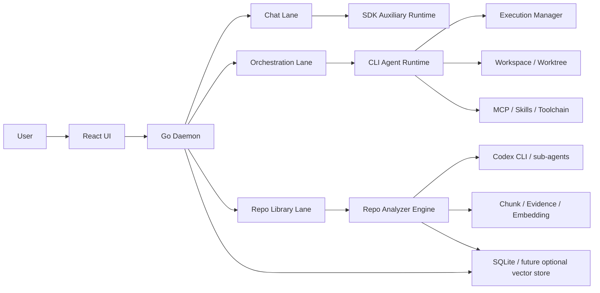
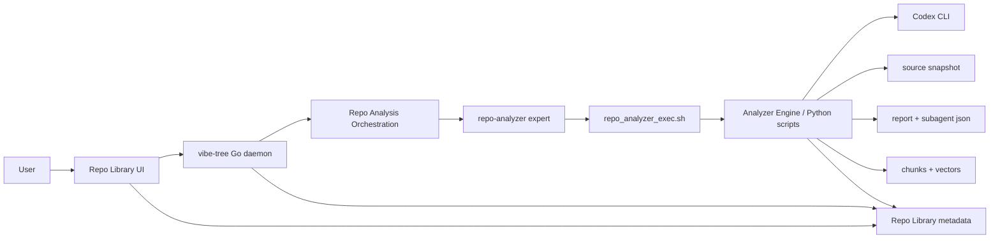

# vibe-tree CLI-First 转型与 Repo Library 集成方案

> 状态：设计草案 / 待落地
> 适用范围：`vibe-tree` 主仓库、当前本地 `github-feature-analyzer` skill、后续 OpenSpec proposal
> 目标读者：产品 owner、后端开发、前端开发、AI/runtime 集成开发

---

## 0. 文档目的

本文档分两大部分：

1. 说明 `vibe-tree` 从当前的 **SDK-first 对话/执行模式**，转向 **CLI-first agent runtime** 的完整思路、边界、模块改造点、实施顺序与风险控制。
2. 说明如何把现有的 `github-feature-analyzer` 从一个本地 skill，演进成 `vibe-tree` 内部的一个长期能力：**Repo Library / Pattern Library / GitHub 项目知识库**。

本文档不是 OpenSpec 变更提案本身，但它可以直接作为后续 `/opsx:propose` 的上游输入。

---

## 1. 执行摘要

### 1.1 核心判断

`vibe-tree` 当前最有价值的不是某个具体模型接入，而是它已经具备的以下基础设施能力：

- 本地 daemon + UI + WebSocket 实时反馈
- execution 生命周期管理
- workspace / git worktree 管理
- orchestration / round / agent_run / synthesis / artifact 这些适合 AI 开发的领域对象
- SQLite 持久化和 daemon 重启恢复

当前的主要问题不在于 UI，也不在于“模型不够强”，而在于：

- **执行抽象层选得偏低**：现在主要围绕 SDK provider（OpenAI/Anthropic）组织能力，而不是围绕 agent runtime 组织能力。
- **chat 与 coding agent 两种场景被混用**：SDK 很适合“问答/摘要/轻量路由”，但不适合天然承接“文件修改/技能加载/MCP/复杂工具链/长上下文 coding session”。
- **模型切换粒度过细**：按消息或按 turn 选择不同 expert/provider/model，在简单对话里合理，但在复杂代码任务中容易破坏连续性、上下文锚点、工具状态和行为一致性。

### 1.2 总体方向

`vibe-tree` 应从“可切模型的多轮 chat + workflow 工具”升级为：

> **本地优先的 CLI-first AI 开发 runtime**

新的总体原则是：

- **CLI 负责主执行**：代码修改、仓库分析、技能使用、MCP、补丁应用、工作目录上下文、长任务执行。
- **SDK 负责辅助智能**：轻量问答、标题生成、专家配置生成、摘要压缩、低成本分类/翻译。
- **Orchestration 成为主产品骨架**：agent run 不再只是“调用一个模型”，而是“运行一个具备工具能力的 CLI agent”。
- **GitHub analyzer 成为 Repo Library**：不再只是一次性报告生成器，而是长期沉淀可检索、可追问、可复用的项目知识库。

### 1.3 目标产品形态

最终产品应同时具备三条能力线：

1. **Chat Lane**：偏问答、轻任务、多模型切换、附件、多模态。
2. **Agent Lane**：偏开发、分析、修改、验证、编排，默认走 CLI runtime。
3. **Repo Library Lane**：沉淀外部 GitHub 项目功能实现知识，并反向为 Chat/Orchestration 提供相似实现检索。

---

# Part I：`vibe-tree` 转向 CLI-first 的完整方案

## 2. 现状分析

### 2.1 当前系统已经具备的优势

当前仓库已经具备以下优秀基础：

- `backend/internal/execution/manager.go`
  - 承接 execution 启动、取消、日志落盘、WS 事件广播。
- `backend/internal/workspace/manager.go`
  - 支持 `read_only` / `shared_workspace` / `git_worktree`。
- `backend/internal/orchestration/manager.go`
  - 负责 orchestration 生命周期、workspace 准备、agent run 调度、终态回填。
- `backend/internal/store/orchestrations.go`
  - 已经定义了 `orchestration` / `round` / `agent_run` / `synthesis_step` / `artifact` 的核心数据模型。
- `ui/src/app/pages/OrchestrationsPage.tsx`
  - 已有 prompt-first 主入口。
- `ui/src/app/pages/OrchestrationDetailPage.tsx`
  - 已能很好呈现 round、agent card、日志、artifact、继续/取消/重试等交互。

这意味着：

- `vibe-tree` 其实已经不是“纯 chat 产品”了。
- 它已经天然更接近“AI runtime 平台”。

### 2.2 当前系统的关键限制

#### 限制 A：SDKRunner 只是“流文本执行器”，不是 agent runtime

当前 `backend/internal/runner/sdk_runner.go` 的真实语义是：

- 根据 provider 选择 OpenAI/Anthropic SDK
- 发起一次请求
- 把流式文本写到 execution output
- 通过一个 `sdkProcessHandle` 伪装成“可等待的进程”

它缺少很多 agent runtime 必备能力：

- 文件修改协议
- patch / apply 协议
- shell/tool 运行语义
- sandbox / approval 语义
- skills 加载
- MCP 工具接入
- 子代理/工作线程拓扑
- tool call 和最终结果的结构化运行时边界

#### 限制 B：Chat lane 强绑定 SDK provider

当前 `backend/internal/api/chat.go` 明确要求：

- `chat` turn 只能使用 `resolved.Spec.SDK != nil` 的 expert
- 非 SDK expert 直接报错

这说明当前 chat 系统不是“可插拔 runtime 的 chat”，而是“SDK provider chat”。

#### 限制 C：同一长任务中切模型会破坏连续性

当前 chat 设计支持“per-message expert override”，但 anchor 复用是有前提的：

- 同 provider + model 时，尽量复用 anchor
- 一旦模型切换，就回退到 reconstructed context

这会在 coding 场景带来几个问题：

- 工具上下文丢失
- 中间推理风格变化
- 工作目录与行为惯例不稳定
- 结果不连续，难以形成稳定 agent persona

#### 限制 D：Orchestration 还不是“真正的 master planner”

当前 `orchestration.Create()` 和 `Continue()` 的 planning 逻辑主要还是：

- 基于文本拆分
- 用启发式判断 `analyze / modify / verify`
- 从可用 experts 里挑一个能 resolve 的 expert

这使它更像“规则驱动的任务拆分器”，而不是“真正的 agent planning runtime”。

---

## 3. CLI-first 的目标状态

### 3.1 目标定义

将 `vibe-tree` 改造为：

> 一个以 Orchestration 为主流程、以 CLI agent 为主执行内核、以 SDK 为辅助智能层、以 Repo Library 为长期知识层的本地 AI 开发平台。

### 3.2 目标能力矩阵

| 能力 | 当前 | 目标 |
| --- | --- | --- |
| 多模型 chat | 已具备 | 保留 |
| per-message expert 选择 | 已具备 | 保留，但主要限于 Chat Lane |
| 代码修改 | 依赖模型输出文字，需自行补执行语义 | 由 CLI runtime 原生承接 |
| 文件系统操作 | 依赖 process/bash 或用户自行 prompt | 由 CLI agent 原生工具链承接 |
| Skills | 基本无原生接入 | 通过 CLI runtime 直接继承 |
| MCP | 基本无统一接入面 | 由 CLI runtime 原生承接 |
| 长任务连续性 | 模型切换时较弱 | 由单一强执行 expert 持续完成 |
| 外部 repo 知识复用 | skill 孤立存在 | 进入 Repo Library，供全局复用 |

### 3.3 目标架构



---

## 4. 总体设计原则

### 4.1 以 runtime 为中心，而不是以 model 为中心

新的系统抽象顺序应是：

1. **任务类型**：chat / analyze / modify / verify / synthesize
2. **运行时类型**：sdk_chat / cli_agent / repo_analyzer
3. **expert persona**：codex-cli / claudecode-cli / repo-librarian / summarizer 等
4. **模型选择**：作为 runtime 内部配置，而不是产品主抽象

### 4.2 复杂任务固定强执行 expert

对于长链路 coding / repo analysis / orchestration：

- 不以“中途切模型”为优化目标
- 以“整个链路使用同一强 agent 完成”为主目标

推荐策略：

- Chat：可切 expert / model
- Orchestration modify/analyze：默认固定 `codex-cli` 或 `claude-cli`
- SDK 模型路由更多用于：
  - 轻量摘要
  - 标题生成
  - 专家生成
  - 翻译
  - 低风险问答

### 4.3 CLI-first 不是 SDK 全废弃

建议保留 SDK，但角色改变：

- SDK 不再承担“主 coding runtime”
- SDK 转为“辅助智能服务”

### 4.4 不推翻 execution/workspace/orchestration 基座

`vibe-tree` 当前已有的 runtime 基础是正确的，应大量复用：

- `execution.Manager`
- `workspace.Prepare()` / `workspace.Inspect()`
- `store.UpdateAgentRunWorkspace()`
- `store.FinalizeAgentRunExecution()`
- `orchestration` 事件、日志、artifact、synthesis 机制

也就是说：

- **保留基座**
- **替换智能执行内核**

---

## 5. 执行模型重构

### 5.1 新的运行时分层

建议在后端形成三个明确 runtime lane：

#### Lane A：SDK Chat Runtime

用途：

- 普通对话
- 附件问答
- 专家生成
- 思考翻译
- 低成本摘要/分类

保留模块：

- `backend/internal/chat/*`
- `backend/internal/api/chat.go`
- `backend/internal/openaicompat/*`

#### Lane B：CLI Agent Runtime

用途：

- 代码修改
- 项目分析
- 多文件重构
- 技能/MCP/tool 使用
- worktree 驱动的开发型执行

新增/改造模块建议：

- `backend/internal/cliruntime/`
- `backend/internal/agentsession/`
- `backend/internal/cliadapter/`

#### Lane C：Repo Analyzer Runtime

用途：

- 外部仓库分析
- GitHub feature analyzer 集成
- 知识抽取与检索

新增模块建议：

- `backend/internal/repolib/`
- `backend/internal/repoanalyzer/`
- 可选 `services/repo-analyzer/`（Python）

### 5.2 expert 的角色调整

当前 `expert` 结构可以继续保留，但要补充“运行时语义”字段。

建议新增：

```json
{
  "id": "codex-cli",
  "label": "Codex CLI",
  "provider": "process",
  "runtime_kind": "cli_agent",
  "cli_family": "codex",
  "tool_mode": "full",
  "supports_skills": true,
  "supports_mcp": true,
  "supports_patch": true,
  "supports_interactive_session": true,
  "command": "codex",
  "args": ["exec", "{{prompt}}"],
  "timeout_ms": 1800000
}
```

建议新增的 `ExpertConfig` 字段：

- `runtime_kind`: `sdk_chat` | `cli_agent` | `repo_analyzer`
- `cli_family`: `codex` | `claude` | `custom`
- `supports_skills`
- `supports_mcp`
- `supports_patch`
- `supports_interactive_session`
- `preferred_for`: `chat` / `analyze` / `modify` / `verify` / `repo_library`
- `execution_contract`: `plain_text` | `json_report` | `artifact_bundle`

### 5.3 `expert.Resolve()` 的重构方向

当前 `Resolve()` 已经能输出 `runner.RunSpec`，这很好，建议继续保留这个统一出口。

但需要让 `Resolve()` 返回更多语义信息：

- `RuntimeKind`
- `ExecutionContract`
- `CLIHints`
- `SkillPolicy`
- `MCPPolicy`

建议扩展 `expert.Resolved`：

```go
type Resolved struct {
    Spec              runner.RunSpec
    Timeout           time.Duration
    ManagedSource     string
    PrimaryModelID    string
    RuntimeKind       string
    ExecutionContract string
    SupportsSkills    bool
    SupportsMCP       bool
    SupportsPatch     bool
    CLIFamily         string
}
```

这样后续的 orchestration / chat / repo-library 就不必再猜测“这是 SDK 还是 CLI，能不能修改代码，能不能承接 skill”。

---

## 6. Backend 改造清单（按模块）

## 6.1 `backend/internal/config/config.go`

### 当前问题

- expert 配置主要围绕 provider/model/command/args 组织
- 对“CLI 运行时能力”描述不够

### 需要做的修改

1. 扩展 `ExpertConfig` 字段，加入 runtime 语义
2. 默认 expert 重组：
   - 保留：`demo`
   - 保留：`bash`
   - 调整：`codex` -> `codex-sdk`
   - 调整：`claudecode` -> `claude-sdk`
   - 新增：`codex-cli`
   - 新增：`claude-cli`
   - 新增：`repo-librarian`
   - 新增：`repo-analyzer`
3. 将“推荐用于 modify/analyze 的 expert”从 SDK 迁到 CLI

### 推荐默认 expert

| id | runtime_kind | 用途 |
| --- | --- | --- |
| `codex-sdk` | `sdk_chat` | chat / 摘要 / 轻量问答 |
| `claude-sdk` | `sdk_chat` | chat / 摘要 / 轻量问答 |
| `codex-cli` | `cli_agent` | modify / analyze / verify |
| `claude-cli` | `cli_agent` | modify / analyze / verify |
| `repo-analyzer` | `repo_analyzer` | GitHub 项目分析 |
| `repo-librarian` | `sdk_chat` 或 `cli_agent` | 检索知识库并为其他任务注入上下文 |

## 6.2 `backend/internal/expert/expert.go`

### 当前问题

- `Resolve()` 已能区分 `process` 与 SDK，但不会表达更高层运行时语义

### 需要做的修改

1. 扩展 `Resolved`
2. 在 `Resolve()` 内识别 `runtime_kind`
3. 对 `provider=process` + `runtime_kind=cli_agent` 的 expert 做更严格校验：
   - 是否声明 `execution_contract`
   - 是否声明 `cli_family`
   - 是否允许 `workspace_mode=git_worktree`
4. 对 `repo_analyzer` 类型允许不同的 prompt/template/contract

## 6.3 `backend/internal/runner/*`

### 当前问题

- `SDKRunner` 与 `PTYRunner` 已有，但没有“CLI agent 适配层”

### 推荐策略

不要直接废掉当前 runner，而是在其上新增一层 **CLI adapter**。

建议新增：

- `backend/internal/cliadapter/spec.go`
- `backend/internal/cliadapter/codex.go`
- `backend/internal/cliadapter/claude.go`
- `backend/internal/cliadapter/contracts.go`

### 作用

CLI adapter 负责：

- 把 agent run 目标拼成 CLI prompt
- 约束输出 contract
- 组织 CLI 所需参数（sandbox/approval/profile/cwd/output schema 等）
- 为 execution artifact 生成额外 side files

### 示例做法

不是让 orchestration 直接把用户目标塞给 `codex exec`，而是：

1. `orchestration.Manager` 产出 agent run
2. `expert.Resolve()` 识别为 `cli_agent`
3. `cliadapter.BuildRunSpec(resolved, agentRun)` 生成最终 `runner.RunSpec`
4. `executionflow.StartRecordedExecution()` 启动 PTY/process

### 为什么要有 adapter

这样以后：

- `codex-cli`
- `claude-cli`
- `repo-analyzer`

都可以共享统一编排方式，但各自拥有不同 prompt contract 和 artifact 收敛逻辑。

## 6.4 `backend/internal/execution/manager.go`

### 当前优势

- execution 生命周期、日志、cancel 都已经很好

### 建议保留不动的部分

- PTY 启动与日志落盘
- WS `execution.started` / `node.log` / `execution.exited`
- Cancel（SIGTERM -> SIGKILL）

### 需要增强的部分

1. 增加 execution metadata
   - runtime kind
   - expert id
   - cli family
   - artifact dir
2. 增加 execution sidecar file 约定
   - `summary.json`
   - `artifacts.json`
   - `session.json`
3. 允许 execution 在结束后由 adapter 做二次 artifact 提取

## 6.5 `backend/internal/orchestration/manager.go`

### 当前问题

- 首轮和续轮规划仍偏启发式
- `chooseAgentExpert()` 默认优先 `codex` / `claudecode` / `demo`
- `buildAgentPrompt()` 太轻，不足以驱动真正的 coding agent

### 需要做的修改

#### 修改一：`chooseAgentExpert()`

改为按 intent 选择 runtime：

- `analyze` -> 优先 `codex-cli` / `claude-cli` / `repo-analyzer`
- `modify` -> 优先 `codex-cli` / `claude-cli`
- `verify` -> 优先 `codex-cli` / `claude-cli` / `bash`

不再优先 SDK expert 作为默认 coding 执行者。

#### 修改二：`buildAgentPrompt()`

拆成 adapter-aware prompt builder，至少包括：

- 任务目标
- 工作目录
- workspace 策略
- 是否允许修改代码
- 输出要求
- artifact 落盘要求
- 如果是 synthesis/verify，要求产出明确的 next action

#### 修改三：planning 机制

短期保留启发式 planning；中期升级为：

- `master-planner` 走 CLI 或 SDK 生成结构化 round plan
- `round plan` 仍然写入现有 `PlannedRound`

这样不需要推翻 store 层。

#### 修改四：agent run 结束后 artifact 提取

当前 `workspace.Inspect()` 只能根据 git diff 产出 `code_change_summary` / `verification_summary`。

后续建议在 `FinalizeAgentRunExecution()` 前增加：

- adapter artifact 解析
- CLI summary 文件解析
- tool call 统计
- patch/apply 结果摘要

## 6.6 `backend/internal/workspace/manager.go`

### 当前优势

- worktree 策略已经做得很对

### 建议增强点

1. 对 CLI agent 增加 workspace policy 注释文件
   - 如在 worktree 根目录生成 `.vibe-tree-agent-context.md`
   - 内容包括 orchestration id、agent run id、目标、限制、输出位置
2. 对 repo-analyzer 场景增加 cache workspace 模式
   - `repo_cache`
   - 专门用于外部仓库分析，不与用户工程 workspace 混用
3. 增加 inspection 扩展
   - 除 git diff 外，还能读取 adapter 生成的 summary/artifacts

## 6.7 `backend/internal/store/orchestrations.go`

### 当前优势

- 数据模型已经很适合 AI 开发平台

### 需要做的增强

建议给 `agent_runs` 增加以下字段：

- `runtime_kind`
- `cli_family`
- `execution_contract`
- `expert_label_snapshot`
- `session_ref`
- `artifact_dir`
- `tool_summary_json`

建议给 `orchestration_artifacts.kind` 扩展更多枚举：

- `cli_session_summary`
- `tool_call_summary`
- `patch_summary`
- `repo_analysis_summary`
- `repo_knowledge_card`
- `repo_search_result`

## 6.8 `backend/internal/api/chat.go`

### 当前问题

- chat turn 明确拒绝非 SDK expert

### 建议路径

#### 短期方案（推荐）

保持 chat 继续只支持 SDK expert，不强行把 CLI 拉进现有 chat API。

原因：

- CLI 型 agent 与 chat 流程并不完全同构
- CLI 可能有更长执行时间、更多工具事件、不同交互 contract

#### 中期方案

新增一个独立的 agent session API，而不是魔改 chat API：

- `POST /api/v1/agent-sessions`
- `POST /api/v1/agent-sessions/:id/turns`
- `GET /api/v1/agent-sessions/:id`

也就是说：

- **Chat API 不改造成万能 runtime 容器**
- **CLI 走独立 Agent Session Lane**

## 6.9 `backend/internal/api/orchestrations.go`

### 需要增强的请求字段

当前创建 orchestration 只有：

- `title`
- `goal`
- `workspace_path`

建议扩展：

- `preferred_runtime`: `auto` | `sdk` | `cli`
- `preferred_expert_id`
- `task_type`: `general` | `coding` | `repo_analysis`
- `repo_url`（仅 repo_analysis 场景）
- `ref`
- `analysis_features`

这样 `orchestration` 既可以承接普通开发任务，也可以承接 Repo Library ingestion。

## 6.10 `backend/internal/ws/*`

### 需要新增事件类型

- `agent.session.started`
- `agent.session.delta`
- `agent.tool.started`
- `agent.tool.completed`
- `agent.patch.generated`
- `agent.artifact.updated`
- `repo.analysis.indexed`
- `repo.library.card.updated`

这些事件不是必须第一版全部实现，但事件模型应先预留。

---

## 7. CLI runtime 的实现建议

## 7.1 CLI 不是直接“裸跑命令”，而是要有 wrapper

推荐新增一层 wrapper 脚本，负责：

- 标准化 prompt 注入
- 标准化输出文件
- 标准化错误码
- 标准化 artifact 写出

建议新增目录：

- `scripts/agent-runtimes/`
  - `codex_exec.sh`
  - `claude_exec.sh`
  - `repo_analyzer_exec.sh`

### wrapper 的职责

1. 读取环境变量：
   - `VIBE_TREE_AGENT_RUN_ID`
   - `VIBE_TREE_WORKSPACE`
   - `VIBE_TREE_ARTIFACT_DIR`
   - `VIBE_TREE_PROMPT_FILE`
2. 拼接 CLI 参数
3. 执行 CLI
4. 把最终摘要和 side artifacts 写回 `artifact_dir`

### 为什么不直接在 Go 里拼全部命令

因为：

- shell 逃逸与 quoting 更复杂
- 多 CLI 族之间参数差异大
- wrapper 更容易本地独立调试
- 将来替换 CLI 更简单

## 7.2 `Codex CLI` 推荐接法

建议分阶段：

### 第一阶段：`codex exec`

用途：

- 后台分析
- 修改型 agent run
- 验证型 agent run

优点：

- 批处理稳定
- 适合 orchestration
- 易于限时、重试、记录 execution

### 第二阶段：`codex app-server`

用途：

- 更强的实时会话
- 更细粒度事件流
- 前端直接展示 plan、delta、tool 流

建议：

- 不在第一阶段就强依赖 `app-server`
- 先用 `exec` 做主执行路径，后续再为 agent session 加 `app-server`

## 7.3 `Claude CLI`/其他 CLI 的接法

设计上不要写死 `Codex`，而是用 `cli_family` 抽象：

- `codex`
- `claude`
- `custom`

不同 family 只在 adapter 和 wrapper 层有差异；execution / workspace / orchestration / artifact 层统一。

## 7.4 CLI 输出 contract

为了避免 execution 最终只有一坨日志，建议约定 artifact 目录格式：

```text
<artifact_dir>/
  final_message.md
  summary.json
  artifacts.json
  tool_calls.jsonl
  patch.diff
  session.json
```

推荐 `summary.json` 结构：

```json
{
  "status": "ok",
  "summary": "完成登录页与设置页重构，新增 3 个组件，修复 2 个状态同步问题。",
  "modified_code": true,
  "next_action": "建议运行前端构建并人工检查主题切换。",
  "key_files": [
    "ui/src/app/pages/LoginPage.tsx",
    "ui/src/app/components/SettingsPanel.tsx"
  ]
}
```

推荐 `artifacts.json` 结构：

```json
{
  "artifacts": [
    {
      "kind": "cli_session_summary",
      "title": "Codex Final Summary",
      "summary": "..."
    },
    {
      "kind": "patch_summary",
      "title": "Generated Patch",
      "summary": "新增 2 文件，修改 5 文件"
    }
  ]
}
```

## 7.5 技能与 MCP 的处理

这是 CLI-first 方案最大的价值点之一。

### 目标

让 `vibe-tree` 自己不去重新实现：

- skills runtime
- MCP routing
- approval/sandbox 策略

而是通过 CLI runtime **继承现成能力**。

### 需要做的事情

1. 在 expert 配置中声明是否允许使用 skills / MCP
2. 在 wrapper 中把必要的环境与工作目录传给 CLI
3. 在 UI 上明确显示“该 agent run 是否支持 skills / MCP”
4. 把 tool/mcp 相关输出收敛为 artifact 或 execution log

### 原则

- `vibe-tree` 不做 skill 平台重写
- `vibe-tree` 做的是“运行、展示、沉淀、编排”

---

## 8. 模型路由策略重构

## 8.1 不再把“按消息切模型”作为 coding 主策略

建议分层：

### Chat lane

- 保持 per-message expert override
- 适合轻量问答

### Orchestration lane

- 以 agent run 为路由单元，而不是以消息为路由单元
- 每个 agent run 固定一个强执行 expert

### Repo analyzer lane

- 每次 analysis run 固定一个 analyzer runtime

## 8.2 新的路由原则

| 任务 | 默认 runtime |
| --- | --- |
| 普通问答 | SDK |
| 多附件解释 | SDK |
| 外部 repo 深分析 | CLI / repo_analyzer |
| 本地代码修改 | CLI |
| 验证/回归 | CLI 或 bash |
| 标题/摘要/翻译 | SDK |

## 8.3 允许模型切换的粒度

推荐只有以下粒度允许切换：

- 新建 chat turn
- 新建 agent run
- 新建 round
- 新建 repo analysis run

不推荐：

- 在同一 modify 型长任务中途自动切换强弱模型

---

## 9. 数据库与持久化变更建议

## 9.1 Orchestration 相关增强

建议迁移：

### `agent_runs`

新增字段：

- `runtime_kind`
- `execution_contract`
- `cli_family`
- `artifact_dir`
- `session_ref`
- `tool_summary_json`

### `orchestration_artifacts`

扩展 kind 值：

- `cli_session_summary`
- `tool_call_summary`
- `patch_summary`
- `skill_usage_summary`
- `mcp_usage_summary`
- `repo_analysis_summary`
- `repo_knowledge_card`

## 9.2 Agent Session（中期）

如果后期要做 CLI 交互会话，建议新增表：

- `agent_sessions`
- `agent_session_turns`
- `agent_session_events`

但这不是第一阶段必须。

---

## 10. UI 改造方案

## 10.1 Orchestrations 首页

### 现状

当前页面已经是 prompt-first，很适合继续演进。

### 需要新增的输入项

- Runtime 偏好：`auto / cli / sdk`
- Task type：`general / coding / repo_analysis`
- Preferred expert
- 是否允许 code modification

### 展示增强

列表项新增：

- runtime kind
- expert label
- 是否使用 worktree
- 是否有 repo library 引用

## 10.2 Orchestration 详情页

### 每个 agent 卡片新增字段

- runtime kind
- cli family
- artifact 数量
- skill/MCP 支持情况
- patch / diff 摘要

### 右侧详情面板新增区域

- CLI final summary
- 生成的 artifacts 列表
- patch 预览链接
- worktree path / branch name

## 10.3 Settings 页面

新增一个 `Agent Runtimes` / `CLI Runtimes` 标签页：

- 配置 `codex` / `claude` CLI 可执行路径
- 默认 sandbox/approval 策略
- 允许的 profile / model / provider
- CLI health check

---

## 11. 分阶段实施计划（CLI 转型）

## Phase 0：方案固化（必做）

- 用 `/opsx:propose` 生成正式 proposal
- 把本方案拆成可实施 tasks

## Phase 1：Runtime 语义落库（低风险）

- 扩展 `ExpertConfig`
- 扩展 `expert.Resolved`
- 给 `agent_runs` 增加 runtime 相关字段
- UI 只做只读展示

## Phase 2：CLI expert 基础接通（关键）

- 新增 `codex-cli` / `claude-cli`
- 新增 wrapper 脚本
- 修改 `chooseAgentExpert()`，让 modify/analyze 默认优先 CLI expert
- 复用现有 `execution.Manager` 和 `workspace` 跑通首个 CLI agent run

## Phase 3：Artifact 收敛（关键）

- 新增 artifact dir
- 解析 `summary.json` / `artifacts.json`
- 在 Orchestration 详情页展示

## Phase 4：Planning 升级（重要）

- 引入真正的 master planner（可先 SDK，后 CLI）
- 将启发式拆分逐步替换为结构化 round plan

## Phase 5：Agent Session（可选）

- 为 CLI 交互式长会话增加独立 session lane
- 可在这一阶段考虑 `codex app-server`

## Phase 6：SDK 退居辅助层（收口）

- Chat 保留 SDK
- Coding 主链路彻底 CLI-first

---

## 12. 测试与验收方案（CLI 转型）

## 12.1 单元测试

- `expert.Resolve()` 对不同 runtime_kind 的解析
- CLI adapter 参数构造
- artifact 解析逻辑
- store migration

## 12.2 集成测试

- 创建 modify 型 orchestration -> 成功跑通 CLI expert
- worktree 正确创建
- execution log 正常流式展示
- execution 完成后 artifact 落库
- retry/cancel 正常

## 12.3 手动验收

- 用户在 Orchestration 页面输入“修改某功能”
- 系统自动选中 `codex-cli`
- 详情页能看到：
  - worktree path
  - branch
  - code change summary
  - final summary

---

## 13. 风险与规避

### 风险 1：CLI 家族差异大

规避：

- 不把差异写进 orchestration
- 只写进 adapter/wrapper

### 风险 2：CLI 输出不稳定

规避：

- 通过 wrapper 生成 side artifacts
- 不强依赖最终 stdout 文本格式

### 风险 3：过早做交互式 agent session

规避：

- 第一阶段只做 `exec` 型离线 execution
- 交互式 session 延后

### 风险 4：SDK 与 CLI 双栈复杂度上升

规避：

- 明确 lane 分工
- Chat 用 SDK
- Coding 用 CLI

---

# Part II：把 `github-feature-analyzer` 变成 `vibe-tree` 的一个功能

## 14. 产品定位

`github-feature-analyzer` 不应继续只作为一个“本地 skill”。

在 `vibe-tree` 中，它应该被重新定位为：

> **Repo Library / Pattern Library / 外部代码实现知识库**

它的价值不只是“看懂某个 GitHub 仓库”，而是：

- 把外部项目的功能实现方式沉淀成可检索知识
- 在做 AI 开发时，为新任务提供相似实现参考
- 形成“分析 -> 沉淀 -> 检索 -> 复用”的闭环

---

## 15. 为什么它非常适合并入 `vibe-tree`

### 15.1 两者能力互补

`vibe-tree` 擅长：

- 任务创建
- agent 编排
- execution 观察
- worktree / artifact / WS

`github-feature-analyzer` 擅长：

- 外部仓库抓取
- README-first 分析
- 子代理分工
- 报告生成
- 历史检索

它们组合后，正好形成：

- 运行平台（`vibe-tree`）
- 知识生产器（`github-feature-analyzer`）

### 15.2 它能反向提升 `vibe-tree`

未来 `vibe-tree` 自己的 coding agent 可以在执行前先问：

- “有没有类似登录流程实现？”
- “有没有类似 DAG 任务编排实现？”
- “有没有类似 SDK/CLI 路由实现？”

然后从 Repo Library 抽取相似模式注入上下文。

---

## 16. 目标产品能力

推荐把 Repo Library 做成三层能力：

### Layer 1：Ingest

用户输入：

- `repo_url`
- `ref`
- `features/questions`

系统执行：

- 拉仓库
- 分析
- 生成报告
- 提取知识卡片
- 建索引

### Layer 2：Search

用户可以：

- 搜索某种功能模式
- 看相似实现
- 看证据链
- 看来源仓库与 commit

### Layer 3：Reuse

用户在 chat / orchestration 中可以：

- 手动引用某个知识卡片
- 自动召回相似模式
- 让 agent 以该知识为参考继续实现

---

## 17. 集成方式选型

## 17.1 方案 A：把 skill 作为本地 process expert 调起来（推荐起步）

### 方式

- 在 `vibe-tree` 中新增 `repo-analyzer` expert
- 其本质是 `provider=process`
- 由 wrapper 调用现有 analyzer 流程

### 优点

- 复用最大
- 上线最快
- 改动对 skill 本体最少

### 缺点

- skill 仍偏“外部脚本包”
- 与 `vibe-tree` 数据模型还不是强耦合

## 17.2 方案 B：把 analyzer 逻辑原生移植进 Go backend（不推荐第一阶段）

### 优点

- 后端一体化

### 缺点

- 迁移成本极高
- Python 向量/检索/文本处理生态优势损失

## 17.3 方案 C：做成 sidecar service（推荐中期）

### 方式

- 新增一个 Python service：`services/repo-analyzer/`
- `vibe-tree` 通过本地 HTTP/CLI 调它

### 优点

- 易于扩展 embedding/retrieval
- 与 `vibe-tree` 保持清晰边界

### 缺点

- 引入双进程/双服务复杂度

### 推荐结论

- **第一阶段用方案 A**
- **第二阶段演进到方案 C**

---

## 18. Repo Library 的推荐架构



---

## 19. 存储设计

## 19.1 不建议继续完全依赖 `.github-feature-analyzer/`

当前 skill 使用项目本地目录：

- `.github-feature-analyzer/{owner-repo}/source`
- `.github-feature-analyzer/{owner-repo}/artifacts`
- `.github-feature-analyzer/{owner-repo}/report.md`

这是 skill 场景下合理的，但集成到应用后，建议迁移为：

- 主存储：`~/.local/share/vibe-tree/repo-library/`
- 兼容导入：仍可读取旧 `.github-feature-analyzer/` 结果

### 推荐目录

```text
~/.local/share/vibe-tree/repo-library/
  repositories/
    <repo_key>/
      snapshots/
        <commit_sha>/
          source/
          artifacts/
          report.md
          subagent_results.json
      index/
        chunks.jsonl
        vectors.npy
      derived/
        cards.json
        tags.json
```

## 19.2 SQLite 数据模型建议

建议新增表：

### `repo_sources`

- `id`
- `repo_url`
- `owner`
- `repo`
- `default_branch`
- `visibility`
- `created_at`
- `updated_at`

### `repo_snapshots`

- `id`
- `repo_source_id`
- `requested_ref`
- `resolved_ref`
- `commit_sha`
- `storage_path`
- `created_at`

### `repo_analysis_runs`

- `id`
- `repo_snapshot_id`
- `orchestration_id`（可空，但建议关联）
- `expert_id`
- `status`
- `language`
- `depth`
- `agent_mode`
- `features_json`
- `report_path`
- `subagent_results_path`
- `created_at`
- `updated_at`

### `repo_knowledge_cards`

- `id`
- `repo_snapshot_id`
- `analysis_run_id`
- `title`
- `card_type`（`project_characteristic` / `feature_pattern` / `risk` / `integration_note`）
- `summary`
- `mechanism`
- `confidence`
- `tags_json`
- `created_at`

### `repo_knowledge_evidence`

- `id`
- `card_id`
- `path`
- `line`
- `snippet`
- `dimension`

### `repo_retrieval_chunks`

- `id`
- `repo_snapshot_id`
- `card_id`
- `section_type`
- `section_title`
- `text`
- `embedding_ref`
- `created_at`

### `repo_similarity_queries`

- `id`
- `query_text`
- `caller_type`（`ui` / `chat` / `orchestration`）
- `caller_ref`
- `top_k`
- `result_json`
- `created_at`

---

## 20. 如何复用现有 analyzer 脚本

## 20.1 可直接复用的部分

- `prepare_workspace.py`
- `fetch_repo.py`
- `build_code_index.py`
- `merge_agent_results.py`
- `render_report.py`
- `reference_retrieval.py`

## 20.2 需要包一层 adapter 的部分

建议新增：

- `services/repo-analyzer/app/ingest.py`
- `services/repo-analyzer/app/extract_cards.py`
- `services/repo-analyzer/app/search.py`

职责：

1. 调现有 skill 脚本跑分析
2. 从 `report.md + subagent_results.json` 提取知识卡片
3. 将卡片和 evidence 写回 SQLite / side store
4. 提供 search/query 接口

## 20.3 为什么不直接让 UI 只看 `report.md`

因为用户真正需要的不是“看一篇长报告”，而是：

- 找到“相似功能”
- 快速理解“实现思路”
- 知道“关键证据在哪”
- 能被其他 agent 自动引用

这要求知识必须结构化。

---

## 21. Repo Library 的产品结构

## 21.1 页面建议

新增一级导航：`Repo Library`

### 页面 A：Repositories

- 已导入仓库列表
- 最近分析时间
- 最新 commit
- 知识卡数量

### 页面 B：Analyze Repo

- 输入 `repo_url`
- 输入 `ref`
- 输入想了解的 feature / questions
- 选择分析深度
- 选择 analyzer expert

### 页面 C：Repo Detail

- 仓库基本信息
- 最近 snapshots
- project characteristics
- feature cards
- 风险卡片
- 搜索框

### 页面 D：Pattern Search

- 搜索“登录认证”、“任务队列”、“本地缓存”、“插件系统”等
- 展示跨仓库相似实现

## 21.2 与 Orchestration 的整合点

### 入口 1：直接创建 repo analysis orchestration

- Orchestration create 请求支持 `task_type=repo_analysis`
- 后端创建专用 `repo-analyzer` agent run

### 入口 2：在 coding orchestration 中调用 Repo Library

- 在规划前或实现前做一次“相似模式召回”
- 把命中的 knowledge cards 作为 artifact 注入当前 round

### 入口 3：在 Chat 中手动引用 Repo Library

- chat composer 增加“引用 Repo Library 结果”入口
- 用户可以选卡片加入当前 turn context

---

## 22. API 设计建议

## 22.1 Repo ingestion

- `POST /api/v1/repo-library/analyses`
  - 入参：`repo_url`, `ref`, `features`, `depth`, `language`, `agent_mode`
  - 行为：创建 analysis orchestration 或 analysis job

## 22.2 Repository list/detail

- `GET /api/v1/repo-library/repositories`
- `GET /api/v1/repo-library/repositories/:id`
- `GET /api/v1/repo-library/repositories/:id/snapshots`

## 22.3 Cards / evidence

- `GET /api/v1/repo-library/cards`
- `GET /api/v1/repo-library/cards/:id`
- `GET /api/v1/repo-library/cards/:id/evidence`

## 22.4 Search

- `POST /api/v1/repo-library/search`
  - 入参：`query`, `repo_filters`, `mode`, `top_k`

## 22.5 Reuse in orchestration/chat

- `POST /api/v1/orchestrations/:id/repo-context`
  - 将搜索结果挂到当前 orchestration 作为 artifact
- `POST /api/v1/chat/sessions/:id/repo-context`
  - 将某个卡片转成 system/context block 注入 chat

---

## 23. 知识抽取策略

## 23.1 从 analyzer 输出抽卡片

推荐从以下来源抽取：

- `report.md`
  - 项目特点
  - 功能说明
  - 五维机制分析
- `subagent_results.json`
  - feature principles
  - evidence items
  - conflicts / unknowns

## 23.2 知识卡片类型

### `project_characteristic`

- 例如：本地优先架构、插件式执行器、多层状态收敛

### `feature_pattern`

- 例如：认证流、消息队列、编辑器插件、任务调度器

### `risk_note`

- 例如：状态收敛风险、并发竞争点、失败恢复缺口

### `integration_note`

- 例如：这个仓库如何调用 SDK、如何处理 CLI runtime、如何组织 workspace

## 23.3 标签建议

- `auth`
- `workflow`
- `queue`
- `cache`
- `editor`
- `cli-runtime`
- `sdk-routing`
- `state-machine`
- `retry`
- `worktree`

---

## 24. Repo Library 如何反哺 AI 开发

## 24.1 Preflight retrieval

在一个 coding orchestration 启动前，系统可以自动做：

1. 根据用户 goal 抽关键词
2. 在 Repo Library 搜相似模式
3. 取 top-k knowledge cards
4. 转成 agent artifact 注入第一轮上下文

## 24.2 Planner augmentation

master planner 可以看到：

- 当前项目目标
- 当前 workspace
- Repo Library 相似模式

这会让规划不再完全凭语言直觉，而有真实参考案例。

## 24.3 Implementer augmentation

modify 型 agent 可以收到：

- 相似实现的机制摘要
- 关键证据文件路径
- 风险提示

注意：

- 不应直接把长报告整篇塞给 agent
- 应该优先提供卡片 + 证据 + 结构化摘要

---

## 25. 分阶段实施计划（Repo Library）

## Phase A：最小接入

- 新增 `repo-analyzer` expert
- 用 process/wrapper 调现有 analyzer
- 结果先挂到 orchestration artifact
- UI 能看 report 路径、summary、report markdown

## Phase B：知识抽取

- 从 report/subagent results 抽取 knowledge cards
- 落库到 SQLite
- 新增 Repo Library 列表/详情页

## Phase C：检索

- 接入 embedding / retrieval
- 新增 search API
- 新增 Pattern Search 页面

## Phase D：反向注入开发流

- coding orchestration 支持引用 Repo Library
- chat 支持手动引用 card

## Phase E：sidecar service 化

- 将 analyzer 脚本从“技能脚本集合”升级为独立 `repo-analyzer` service
- 由 `vibe-tree` 调其 ingest/search/extract API

---

## 26. OpenSpec 拆分建议

建议后续至少拆成 3 个 changes，而不是一次做完：

### Change 1：CLI-first runtime foundation

范围：

- expert/runtime 语义扩展
- CLI expert 接通
- orchestration 默认路由到 CLI

### Change 2：Agent artifact & CLI observability

范围：

- artifact dir
- summary/artifacts 收敛
- UI 展示增强

### Change 3：Repo Library integration

范围：

- repo analyzer expert
- repo library 数据模型
- ingestion/search/reuse

---

## 27. 最终建议（明确结论）

### 对 `vibe-tree`

最重要的决策不是“继续增强 SDK”，而是：

- 把 **CLI runtime** 升级为主执行路径
- 把 **SDK** 降为辅助智能层
- 把 **Orchestration** 固定为主产品骨架

### 对 `github-feature-analyzer`

最重要的决策不是“继续作为一个 skill 打补丁”，而是：

- 把它升级为 `vibe-tree` 内部的 **Repo Library / Pattern Library**
- 让它服务于后续所有 AI 开发任务

### 对实施方式

最优路线是：

1. 不推翻现有 execution/workspace/orchestration 基座
2. 先让 CLI expert 跑起来
3. 再把 analyzer 作为 repo 功能接进来
4. 最后做知识检索和反向复用

这条路径兼顾：

- 风险最小
- 价值最快落地
- 架构长期正确

---

## 28. 附：建议新增文件清单（按阶段）

### CLI-first 阶段

- `backend/internal/cliadapter/spec.go`
- `backend/internal/cliadapter/codex.go`
- `backend/internal/cliadapter/claude.go`
- `backend/internal/cliadapter/contracts.go`
- `scripts/agent-runtimes/codex_exec.sh`
- `scripts/agent-runtimes/claude_exec.sh`
- `backend/internal/api/agent_sessions.go`（中期）

### Repo Library 阶段

- `backend/internal/repolib/service.go`
- `backend/internal/repolib/store.go`
- `backend/internal/repolib/search.go`
- `backend/internal/api/repo_library.go`
- `ui/src/app/pages/RepoLibraryPage.tsx`
- `ui/src/app/pages/RepoRepositoryDetailPage.tsx`
- `ui/src/app/pages/RepoPatternSearchPage.tsx`
- `scripts/agent-runtimes/repo_analyzer_exec.sh`
- `services/repo-analyzer/app/ingest.py`（中期）
- `services/repo-analyzer/app/extract_cards.py`（中期）
- `services/repo-analyzer/app/search.py`（中期）

---

## 29. 建议的下一步

如果按仓库规范推进，接下来建议的动作顺序是：

1. 基于本文档执行一次 `/opsx:propose`
2. 先落一个最小 change：`cli-first-runtime-foundation`
3. 跑通一个真实 `codex-cli` modify 型 orchestration
4. 再做第二个 change：`repo-library-ingestion`

到这一步，`vibe-tree` 就会从“一个会聊天、能跑点 workflow 的工具”，变成“一个真正能承接 AI 开发与外部知识复用的平台”。
